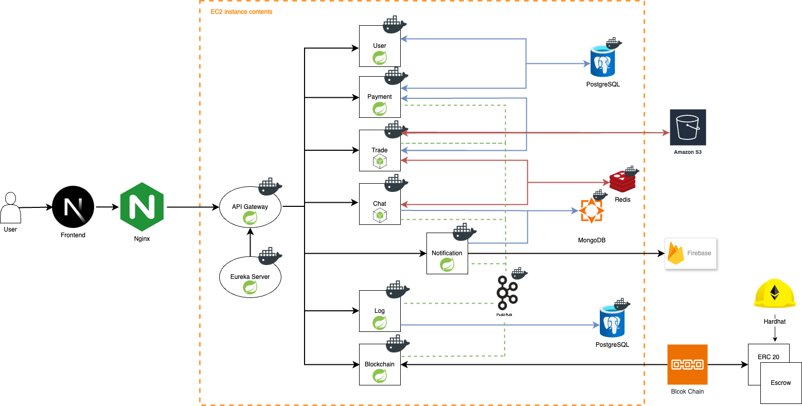
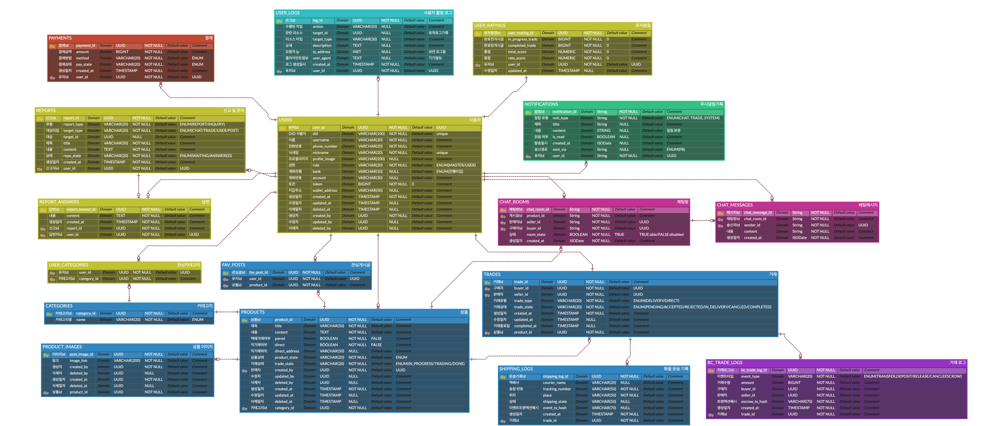

# Re-Use

# 프로젝트 개요

> `Re-Use`는 DID(Decentralized Identifier) 기반 신원 인증과 블록체인 기술을 활용하여 투명하고 안전한 중고 거래 환경을 제공하는 플랫폼입니다.

`Re-Use`는 다음과 같은 핵심 기능을 중심으로 신뢰 기반의 거래 구조를 구축합니다.

1. **DID 기반 신원 인증**으로 사용자의 실체를 검증하고, **비대면 환경에서도 신뢰할 수 있는 거래**를 가능하게 합니다.
2. 회원가입 과정에서 **eWallet을 자동 발급**하여, 사용자는 본인 식별과 자산 관리를 하나의 지갑에서 통합적으로 관리할 수 있습니다.
3. **ERC-20 기반 토큰**을 활용한 거래를 통해, **지급/정산/보상 내역이 투명하게 블록체인에 기록**됩니다.
4. 택배 거래 시, **화물의 실시간 위치를 추적 및 기록**하며, 사기 발생 시 **거래 리포트를 제공**하여 사용자 보호를 강화합니다.

# 기획 배경 및 목적

## 기획 배경

현재의 중고 거래 플랫폼은 신원 위·변조, 거래 사기, 택배 사고 등의 문제로 인해 사용자 간 신뢰 확보에 한계를 보이고 있습니다.

특히 비대면 거래에서는 상대방의 실체 확인이 어렵고, 문제 발생 시 거래 이력을 객관적으로 증명하기가 어렵습니다.

## 기획 목적

1. DID 기반 신원 인증으로 사용자 실체를 검증하고 거래 신뢰도를 높입니다.
2. eWallet 및 블록체인을 활용해 거래 내역의 투명성과 위·변조 방지를 보장합니다.
3. 택배 위치 추적 기능을 통해 사기 예방 및 거래 리포트 제공이 가능한 안전한 거래 환경을 구현합니다.

# 주요 기능

| 기능 구분   | 기능명                        | 설명                                    |
|---------|----------------------------|---------------------------------------|
| 회원 관리   | DID 기반 회원가입 및 로그인          | eWallet을 통해 DID 생성 및 검증 기반 로그인 처리     |
|         | eWallet 발급                 | 회원가입 시 자동 지갑 생성 (비대칭키 기반)             |
|         | 사용자 정보 조회/수정               | 기본 프로필 및 인증 상태 관리                     |
| 상품 거래   | 상품 등록/수정/삭제                | 사용자가 판매 상품을 등록하고 편집                   |
|         | 상품 검색 및 상세 조회              | 키워드/카테고리 기반 상품 탐색 기능                  |
|         | 거래 신청 및 승인                 | 구매자가 거래 요청, 판매자는 승인                   |
|         | 택배 상품 등록 및 위치 추적           | 화물 위치 자동 추적 (제3자 API 또는 추적 DB)        |
|         | 거래 완료 및 자동 평가              | 송장 기반 배송 완료 후 자동 상태 변경                |
| 리뷰 및 평점 | 리뷰 및 평점 기록                 | 거래 완료 시 수행, 사용자 평점 업데이트               |
| 결제/정산   | 토큰 충전 및 보유량 확인             | ERC-20 기반 토큰 연동, Web3.js 사용           |
|         | 거래 대금 Escrow 입금 처리         | 스마트 컨트랙트를 통한 중립적 보관                   |
|         | 거래 완료 후 자동 정산              | 판매자에게 Escrow 토큰 자동 이체                 |
|         | 환전                         | 사용자가 토큰을 실화폐로 환전하는 기능                 |
| 채팅      | 실시간 채팅                     | 구매자/판매자 간 거래방 단위 실시간 메시지              |
|         | 메시지 이력 확인 및 저장             | Redis 캐시 후 MongoDB 저장                 |
| 알림      | 거래 상태, 채팅 알림               | Firebase를 통한 푸시 메시지 발송                |
| 로그      | 사용자 활동, 결제 및 거래, 오프체인 로깅 | 모든 주요 행위 및 오류 로깅 (PostgreSQL)         |
| 신고 및 문의 | 신고/문의 접수                   | 채팅, 거래, 사용자, 상품에 대한 신고/문의 접수          |
|         | 신고/문의 응답                   | 접수된 신고/문의사항에 대한 답변 및 조치, 거래 내역 리포트 제공 |

# 시스템 구성도 및 기술 스택

## `Frontend`

## `Backend`

## `Blockchain`

# ERD

# 기대효과 및 차별성

> **기존 중고 거래 플랫폼이 해결하지 못한 ‘신뢰’와 ‘투명성’ 문제를 DID와 블록체인을 통해 해결**하며,
> **Web2 유저가 자연스럽게 Web3 환경으로 넘어올 수 있는 서비스 경험을 제공**하는 것이 이 프로젝트의 핵심 차별점입니다.

1. **DID 기반으로 사용자 신뢰 확보**
    1. 자기주권 신원(DID)을 기반으로 사용자의 신원을 위·변조 없이 검증함으로써, 중고 거래 시 신뢰기반을 강화합니다.
    2. 플랫폼이 직접 개인정보를 보관하지 않아도 되므로, 개인정보 유출 리스크를 대폭 줄일 수 있습니다.

2. **블록체인 연동으로 거래 투명성 확보**
    1. 거래 내역은 블록체인 상의 스마트 컨트랙트를 통해 탈중앙화된 방식으로 기록 및 정산되며, 누구나 확인 가능한 방식으로 투명성과 조작 방지를 실현합니다.
    2. ERC-20 기반 토큰을 활용한 거래 시스템 및 Escrow 모델로, 거래 사기 및 분쟁을 방지할 수 있습니다.

3. **배송 추적 통합으로 사기 방지 및 신속 대응**
    1. 택배 배송 상태를 추적 및 기록하고, 이는 거래와 연동되어 보존되므로, 문제 발생 시 책임 소재를 명확히 할 수 있습니다.

4. **Web3 친화적 사용자 경험**
    1. 사용자는 하나의 eWallet으로 DID 인증, 토큰 보유, 거래 참여까지 가능하여 Web3 기반 사용자 경험을 자연스럽게 체감할 수 있습니다.
    2. 플랫폼 진입 장벽을 낮추고, 미래 확장 시 NFT 보증서, DAO 기반 커뮤니티, 디지털 소유권 인증 등 다양한 확장성과 연결됩니다.

5. **분산 시스템 기반 아키텍처로 유연성과 확장성 확보**
    1. DID, VC, 블록체인, 실시간 채팅 등 다양한 기술 스택을 역할별로 분리한 MSA 기반 설계로 향후 트래픽 증가 및 기능 확장에 유리합니다.
    2. MongoDB, Redis, PostgreSQL 다중 DB 구조로 각 기능의 처리 특성에 맞춘 효율적인 데이터 운용이 가능합니다.

# 향후 확장 방향

> 본 프로젝트는 향후
>
> **AI 기술을 활용한 개인화 추천 및 위험 거래 탐지**,
>
> **Web3 확장성과 DID 신원 기반 거래 생태계의 고도화**,
>
> 그리고 **지속 가능한 커뮤니티 주도 운영 구조(DAO)** 로의 진화를 통해
>
> 단순 거래 플랫폼을 넘어선 **탈중앙 신뢰 기반 유통 플랫폼** 으로 성장할 수 있습니다.
>

1. **AI 기반 개인화 추천 시스템 고도화**
    1. 선호 카테고리, 검색 이력, 거래 이력, 클릭 로그 등을 분석하여 사용자의 관심사를 파악
    2. 상품 특징(텍스트, 이미지) 기반 유사도 분석을 통해 콘텐츠 기반 필터링 추천 적용
    3. 향후에는 사용자-상품-행동 그래프를 활용한 그래프 기반 추천 알고리즘(GNN 등) 도입 가능
    4. 챗봇 또는 음성 추천 기능 연계로 자연어 질의 기반 상품 탐색도 구현 가능

2. **AI 기반 이상 거래 탐지 및 사기 방지**
    1. 거래 시간, 위치, 평점, 배송 속도 등 이상 패턴을 학습하여 사기 가능성 높은 거래 자동 감지
    2. 사용자 행동 로그 딥러닝 기반 거래 신뢰 점수 모델 구축
    3. 자주 신고되는 사용자의 행동 패턴을 사전에 차단하거나 거래 위험도 라벨링 제공

3. **Web3 확장형 보상 및 경제 시스템 구축**
    1. 거래 활동, 리뷰 작성, 신고 처리, 피드백 기여 등 행위 기반 토큰 보상 구조 설계(Play-to-Earn 유사 모델)
    2. DAO 기반 사용자 운영 참여 시스템: 거래 규칙, 수수료 구조 투표 등 커뮤니티 중심 운영 도입
    3. 향후 상품 소유권을 NFT로 발행하여 소장/인증/리셀 흐름으로 확장 가능

4. **물류 및 거래 추적 시스템의 고도화**
    1. 배송 지연 자동 감지 및 구매자-판매자 간 분쟁 해결 자동화 추천 시스템

5. **글로벌 마켓 연계 및 다국어 지원**
    1. 해외 사용자 유입 대비를 위한 다국어 VC 표준 채택 및 자동 번역 API 연계
    2. 국가별 거래 정책 차이를 반영한 로컬라이징 규칙 엔진 적용

# 결론 및 요약

> **Re-Use**는 사용자에게는 안심할 수 있는 거래 환경을, 플랫폼에는 지속가능한 신뢰 구조를,
>
> 그리고 산업 전체에는 Web3로의 전환 사례를 제시하는 실질적 혁신 플랫폼입니다.
>

Re-Use는 DID 기반의 신원 인증과 블록체인 기술을 결합하여, **신뢰 기반 중고 거래 플랫폼의 새로운 표준**을 제시합니다.

기존 중고 거래 서비스들이 해결하지 못한 **사용자 간 신원 불일치, 사기, 거래 불투명성** 문제를 기술적으로 해결하며, 사용자는 하나의 eWallet으로 **신원 인증, 자산
보유, 안전한 거래 참여** 까지 경험할 수 있습니다.

또한, **AI 기반 추천 시스템**, **토큰 기반 리워드**, **Escrow 스마트 컨트랙트**, **실시간 배송 추적**, **멀티 플랫폼 확장성** 등 다양한 고도화
요소를 통해, 단순 거래를 넘어 Web3 기반 신뢰 유통 생태계로 확장 가능한 구조를 갖추고 있습니다.